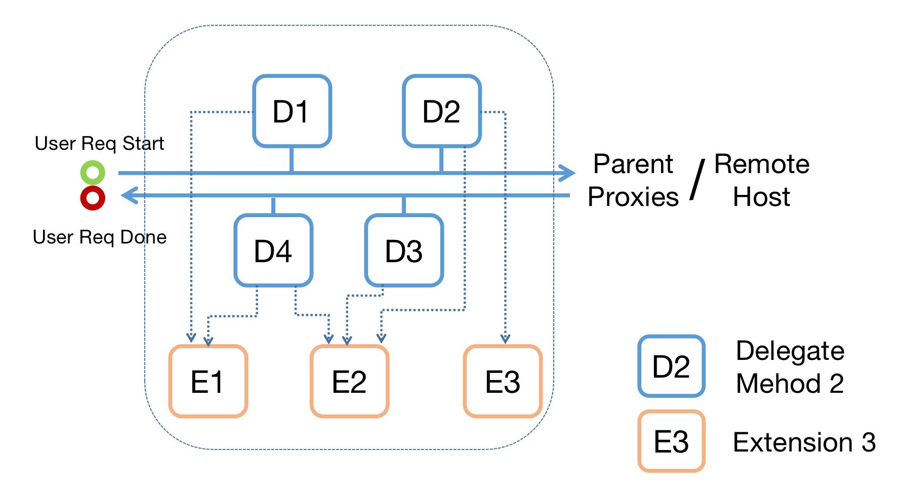

# proxychannel

Package proxychannel is a customizable HTTP proxy framework in Golang.

It accepts regular HTTP and CONNECT(for HTTPS) requests, and hijacks HTTPS connections as a "man in the middle"(only works under NormalMode).

The framework starts a proxy server(``net/http`` server) and an extension manager, do something according to ``Delegate``, and handles the graceful shutdown and logging of them. To use it, just offer some configuration, and implement the ``Delegate`` and ``Extensions`` that you need.

It has 2 modes(NormalMode and ConnPoolMode) for different scenarios and supports request-wise parent proxy selection.

## Install

```
go get github.com/spritesprite/proxychannel
```

## Conception & Features

* Delegate: An interface that defines some manipulation on requests or responses in defferent stages of the proxying process.

* Extension: An interface that provides certain functionality. All extensions are under extension manager's controll, and they basically serve for Delegate.



* Context: The information of each request, including the timestamps, response size, error type, user-defined data member, etc.

* NormalMode: proxychannel forwards requests to parent proxy, and returns whatever it gets from parent proxy back to requestor. 

* ConnPoolMode: proxychannel chooses a TCP connection by given probability from the ConnPool, which is specified by ``p.delegate.GetConnPool()``. If proxychannel fails to connect parent proxy or gets a response body in JSON format that has an "ErrType" of "PROXY_CHANNEL_INTERNAL_ERR"(when the parent proxy is also a proxychannel instance), it retries the request using another proxy chosen from ConnPool by given probability. The retry goes on until any parent proxy returns a 200 response code or every connection has been tried.

## Usage

### Get it Started

To start a basic HTTP proxy that listens on ``localhost:8080``, try:

```
go run examples/main.go
```

Now check if the proxy works properly:

```
curl -x localhost:8080 https://www.google.com/
curl -x localhost:8080 http://www.google.com/
```

To try the "Man in the middle" functionality, install certification authority(CA) ``cert/mitm_proxy.crt`` first(if you happen to use CentOS, just use ``cert/centos_cert_install.sh`` to install CA), and run:

```
curl -x localhost:8080 https://www.google.com/ -H "MITM:Enabled" -v
```

The "Man in the middle" feature is functioning properly, if you could find in verbose output of curl something like: ``issuer: CN=go-mitm-proxy``.

### Customize your proxychannel

* Customize Delegate

According to the definition of Delegate, implement the methods you need.

```
type Delegate interface {
	GetExtensionManager() *ExtensionManager
	SetExtensionManager(*ExtensionManager)
	Connect(ctx *Context, rw http.ResponseWriter)
	Auth(ctx *Context, rw http.ResponseWriter)
	BeforeRequest(ctx *Context)
	BeforeResponse(ctx *Context, i interface{})
	ParentProxy(ctx *Context, i interface{}) (*url.URL, error)
	DuringResponse(ctx *Context, i interface{})
	Finish(ctx *Context, rw http.ResponseWriter)
	GetConnPool(ctx *Context) ([]randutil.Choice, error)
}
```

For example, this ``Finish`` method generates some logs for each request:
```
func (d *YourDelegate) Finish(ctx *proxychannel.Context, rw http.ResponseWriter) {
    GenerateLog(ctx) // generate log based on the information stored in ctx
}
```

* Customize Extension

To add an extension, just implement the ``Setup()`` and ``Cleanup()`` methods. For example, if your proxy needs some information stored, you may add a redis extension with ``Setup()`` building a connection pool to redis server and ``Cleanup()`` closing the pool.
